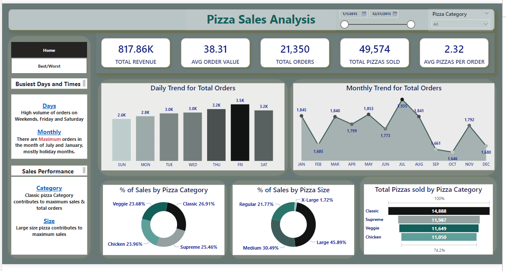
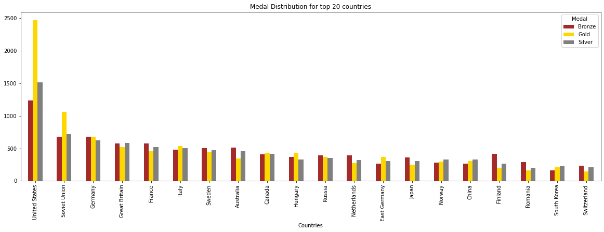
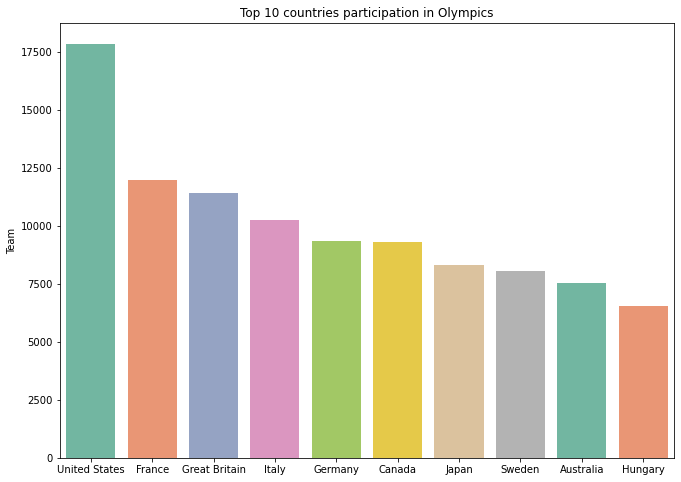

# Madhuri's Portfolio

## Project 1: [Pizza Sales Analysis — (SQL-PowerBI)](https://github.com/madhurilm/Pizza-Sales-Analysis-SQL-PowerBI-)

This project involves analyzing sales data from a pizza chain to derive actionable insights and trends.Analyzed sales patterns to identify popular pizza choices, peak sales periods, and customer preferences.Visualized findings through charts, graphs, and reports to facilitate easy interpretation to informed decisions to increase the sales next year.

---

## Project 2: [Music Store Analysis — (SQL)](https://github.com/madhurilm/Music-Store-Analysis-SQL-)

The main objective of this project is to provide a comprehensive analysis of online music store sales data using SQL queries and analyszed sales, customer behavior, genres.

---

## Project 3: [Olympics-DataAnalysis-using-Python](https://github.com/madhurilm/Olympics-DataAnalysis-using-Python)

 

The main objective of this project is to provide analysis which includes medal distribution, age-performance distribution, historical trends of gender-based participation, distribution of sports where different countries won medals etc.

---

## Project 4: [Customer-Segmentation using MachingLearning Algorithm](https://github.com/madhurilm/Customer-Segmentation)

Object of the project is to give useful insights about customer and also to Segment the customer based on their purchasing behavior to improve Store revenue. We will train the model using KMeans clustering, unsupervised Machine learning algorithm as we need to segment the customer as per their purchasing behavior.
